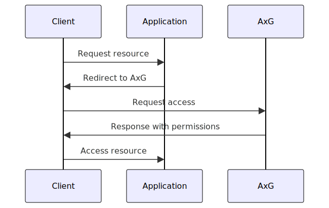
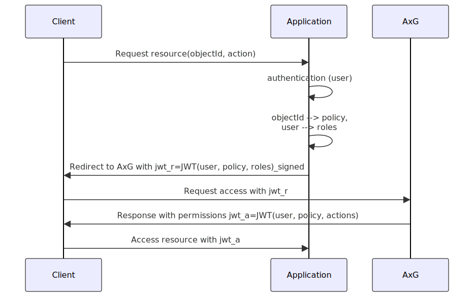

= AxsessGard (AxG)

== Description

AxsessGard (AxG) is a microservice providing access control information.
AxG can be queried by third-party applications to determine whether a user has permission to access a resource.
AxG uses a policy-based access control model, allowing fine-grained control over user permissions.

Enforcing the control remains in the hands of the application.
AxG gives only advice that the application can use to make decisions.

AxG provides a REST interface for querying permissions.
The REST interface can be accessed directly by the application or by the client.
To get the access control advice, the request should contain a JWT signed by the application.

The advice will list all the permissions for the parameters provided in the signed request.

.Overview of the AxG authorization process

== Current Status

AxG is currently a work in progress.
This README provides an overview of the core concepts and functionality.
Installation guides and more detailed documentation will be available in future releases.

== Technology Stack
- Kotlin
- Spring Boot
- JPA (Java Persistence API)

== Features
- JWT-based authorization
- Attribute-based access control (ABAC)
- Policy-based permissions
- Integration with existing application servers
- Database-agnostic (supports any database compatible with JPA)

== How It Works

.Overview of the AxG authorization process (details)

. A client requests access to a resource from a third-party application server.
. The application server authenticates the user. (AxG does not handle authentication).
. The application server creates a signed JWT (`jwt_r`)containing:
   ** User-ID
   ** Policy-ID controlling access to the resource
   ** List of user roles

. The application server directs the client to AxG for **authorization**.

. AxG verifies the JWT signature and checks the provided information against its database.

. AxG issues a signed JWT containing all actions the user is allowed to perform.

. The client can use this JWT to access permitted resources on the application server.

The permissions for the AxG server are meaningless words.
The AxG server has no knowledge of the meaning of the permissions.
It simply maintains the relationship between the user, the policy, and the permissions.

The policies are implemented as Access Contol Lists (ACLs).
Each ACL contains one or more Access Control Elements (ACEs).
Each ACE contains a name and the actions allowed by the ACE for that name.
The name can be the name of the user, group membership, role etc.
The set of role identifiers and the user name are taken into account calculating the actual permissions.

A user has a permission for an action `A` if there is an ACE in the ACL that

* has the user's name or a role listed in the requesting JWT in the name field, and
* the action `A` in the action field.

It is the responsibility of the 3^rd^ party application:

* Interpret the permissions and to enforce the access control.

* Ensure that the user is authenticated before the request is sent to AxG.

* Identify the policy name that controls the access to a certain resource.

* Identify the list of roles that the user has.

== API Reference

The api can be categorized into two type of end-points:

* Service end point, and
* Maintenance end points

There is a single service endpoint, `/axsg/permissions`.

Maintenance end-points are used to manage the service.
To access these end-points, the client must have the appropriate permissions.
The client has to represent the permissions in the JWT.
To get the JWT, the client has to request the JWT from the service end point.

NOTE: The services implemented here could calculate the permissions based on the user's roles and the policy.

The maintenance end points provide the basic CRUD operations.

=== GET `/axsg/permissions`

Get the permissions, specifically the list of actions that a certain `user` bearing `roles` is allowed to perform on an object controlled by the `policy`.
The `user`, `policy` and the list of `roles` are claims delivered by the JWT in the authentication header.
The JWT has to be signed by one of the known applications configured in the application.

=== GET `/axsg/acl/{name}`

Get the ACL content for a given `name`.
The `name` is a unique identifier for the ACL content.

=== PUT `/axsg/acl/{name}`

Update the ACL content for a given `name`.
The `name` is a unique identifier for the ACL content.
The `ACL` object is passed in the request body.
Note that the name in the new value may be different from the name in the path.
This is the way how you can rename the ACL content.
To perform the operation the client should have `write` permission on the ACL object.

=== POST `/axsg/acl`

Insert the ACL content.
The `ACL` object is passed in the request body.
To perform the operation the client should have `create` permission in the `createAcl` ACL.

=== GET `/axsg/put/acl/{name}`

Signal an attempt to modify the ACL content for a given `name`.
The call can be used to get the permission request JWT and the location without sending the actual ACL content.
Authorization JWT in the request header is ignored.

=== GET `/axsg/post/acl`

Signal an attempt to create a new ACL content.
The call can be used to get the permission request JWT and the location without sending the actual ACL content.
Authorization JWT in the request header is ignored.

=== GET `/axsg/acls/{name}`

List all the ACLs that start with the given prefix `name`.
To perform the operation the client should have `list` permission in the `listAcls` ACL.

== Configuration

=== Environment Variables

The application can be configured using environment variables.

* `AXSG_PUBLIC_KEY` should define the public key used to verify the JWT signature.
    This value should also be known to the third-party application.
    They need to be used to verify the JWTs issued by AxG.

* `AXSG_PRIVATE_KEY` should define the private key.
    This key is used to sign the JWTs issued by AxG.
    The key should be kept secret.
    In production, the key should be stored in a secure location.

* `AXSG_ALGO_TYPE`
    The type of the algorithm used to sign the JWTs.
    The JDK libraries currently support
    ** `EC` for Elliptic Curve, and
    ** `RSA` for RSA.
* `AXSG_ALGO` the actual algorithm to use.
    It has to match the algorithm type.

* `AXSG_INIT_DATA` The initial data file.
    This data file can contain an initial set of policies and roles.
    During startup this file is read and loaded into the database only if the database is empty.

* `AXSG_CONFIG_DIR` The directory where the configuration files are stored.
    The default value for this is `/etc/axsessgard`.

=== Partner Applications

The directory `applications` should contain the configuration of the partner applications.
All files in this directory are scanned and read during the startup of the application.
A sample configuration file is shown below:

[source]
----
ID: issuer1
ALGO: ECDSA256
ALGO_TYPE: EC
KEY: MFkwEwYHKoZIzj0CAQYIKoZIzj0DAQcDQgAEo2SGwd5psDsfx1gwirzZP+udK1FlWl7t3Ho7tnZqJ+96oOgW/w3nKrXGU/SYbqOgdpB8D8A+Y4MqfCjmstOLFg==

ID: issuer2
KEY: MFkwEwYHKoZIzj0CAQYIKoZIzj0DAQcDQgAELG7D9MxtHVXfVP/C/RrCdVdPrqiOiQovgcLgzyNbHZBsXxfyFJhYTWNSHn7qCF1enrbPR14exhYh1BhXPVKWxA==
----

The lines in this file have `KEY: VALUE` pairs.

NOTE: Even if the actual sample key value is shown on a separate line in this document, it has to be at the same time and in a single line.
Actual line breaks in this document are created by the formatting.
If in doubt, have a look at the actaul `src/main/resources/config/applications/issuers` file.

* The `ID` is the identifier of the application.
The same literal will come in the JWT in the permissions `GET` request as issuer.

* `ALGO_TYPE` is the type of the algorithm.
    The JDK libraries currently support
    ** `EC` for Elliptic Curve, and
    ** `RSA` for RSA.

* `ALGO` is the algorithm used to sign the JWTs.
    It has to match the algorithm type.

* The `KEY` is the public key of the application.

The algorithm type, algorithm, and issuer id definition have to precede the key definition.

The algorithm type and the algorithm definitions do not need to be repeated for each key if they are the same.
They can be redefined within a single file before any key definition.

Lines starting with `#`, `//` or `--` are comments and are ignored.

The list of partner applications and the keys are read during the application startup.

This file is supposed to be maintained by the system personnel, and therefore it is allowed to

* have spaces around the separators,
* have comments,
* have empty lines, and
* the reading process fails if there is a non-processable, erroneous line.

=== Policy and Role Configuration

The policies are stored in the database.
If the configured database does not contain any policies, then the application will load an  initial set of policies from the file defined in the `AXSG_INIT_DATA` environment variable.

It can be used in test environments or small-scale deployments where

* the number of policies is limited, and
* do not change frequently.

It is not a recommended practice in a production environment.
A production environment may use this feature to load the initial set of policies and roles.

A sample file is provided `src/main/resources/sample_data.txt`.

[source]
----
ACL:ReadOnlyAccess
ACE:user1:read
ACE:ROLE_ADMIN:read,write
ACE:developers:read,write,delete

ACL:FullAccess
ACE:user2:read,write,delete
ACE:ROLE_SUPERADMIN:read,write, delete,admin

ACL:listAcls
ACE:listAcls:list

ACL:createAcl
ACE:createAcl:create
----

The file contains

* `ACL:name` lines to define a policy,
* `POLICY:name` lines that define the name of the ACL that controls the access via the maintenance end-poiints to this ACL.
* `OWNER:name` lines to define the owner of the ACL.
  When the current user is the defined owner of the ACL then the role is automatically added to the user.
* `ACE:name:actions` lines to define the actions allowed by the policy for a given name.

The actions are separated by commas.
Spaces are not allowed before or after the commas and the `:` characters.
Every other line is silently ignored to discourage the production use of this feature.

=== Special Policies

The service end point does not care about any permissions itself, it only serves them to anyone with a valid JWT signed by a known application.

The maintenance endpoints are protected by the service itself.
The ACL objects are protected by the policy specified in the ACL object.
If this value is null, then the ACL object is not protected.

There are two special policies the maintenance endpoints

* `POST /axsg/acl`,
* `GET /axsg/post/acl`, and
* `GET /axsg/acls/{name}` use.

The `POST /axsg/acl` endpoints are used to create new ACL objects.
It can only be performed if the user has the `create` right granted by the ACL `cleateAcl`.

The `GET /axsg/post/acl` end point uses the same policy as the `POST /axsg/acl` end point.
It can be used to initiate an ACL creation process before the authorization JWT is available.

The `GET /axsg/acls/{name}` end point is used to list the ACL objects by name prefix.
It can only be performed if the user has the `list` right granted by the ACL `listAcls`.

In all other cases the ACL given by the name in the `POLICY` line is used to protect the ACL object.

== Security Considerations

* All JWTs in the system are signed, including AxG's responses.
+
The JWTs are not encrypted.

* AxG does not handle user authentication; this responsibility lies with the third-party application.
+
As a 3^rd^ party application, AxG maintenance endpoints assume that the applicatoin is installed behind a proxy handling the authentication securely.
The user information is passed by the proxy in the HTTP header field `X-USER-ID`.
A sample configuration can be found in the docker file in the root directory of the project.
It uses an nginx proxy to require basic authentication and to pass the user information to the application.

== License
Apache License 2.0

'''

AxsessGard is under active development.
Features, API, and documentation are subject to change.
For the latest updates or to contribute to the project, please contact the development team.